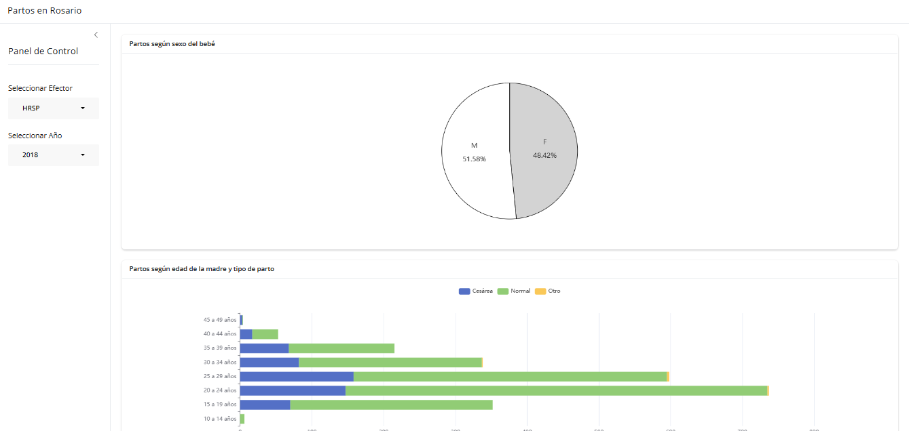

<style>
h1.title {
  color:#76EEC6;
  text-align: center;
}
h4.author {
  color: #999;
  text-align: center;
}
h4.date {
  color: #999;
  text-align: center;
}
</style>


```{r setup, include=FALSE}
knitr::opts_chunk$set(echo = TRUE)
library(shiny)
library(shinyWidgets)
library(echarts4r)
```

<br><br>


# Comunicación de Resultados &#x279C; *Dashboards*

Vamos a hablar sobre **tableros** (*dashboards*) que son herramientas digitales orientadas a la visualización de una gran cantidad de indicadores relevantes para una empresa.
Se caracterizan por **resumir** la información mas importante en pocos cuadros o gráficos, utilizando los datos de manera periódica, permitiendo un **monitoreo en tiempo real** del proceso que estamos analizando.

Algunos ejemplos.


# Dashboards con **bslib**

Vamos a ver como usar *bslib* para crear la **interfaz**.

&#x279C; la estructura de un dahsboard puede crearse proporcioando :

- un *title*

- *sidebar*

- y un contenido del área principal a *bslib::page_sidebar()*

```{r, eval= FALSE}
ui <- bslib::page_sidebar(
  title = "Mi Tablero",
  sidebar = "Sidebar",
  "Contenido del área principal"
)

server <- function(input, output) {} #Al server lo vemos mas adelante

shiny::shinyApp(ui, server)
```

Tanto el **sidebar** como el contenido del **área principal** &#x279C; pueden contener cualquier cantidad arbitraria de **elementos** de interfaz, pero es mejor poner los **inputs en el **sidebar** y los **outputs** en el **área principal**. 

&#x279C; se recomienda poner los **outputs** dentro de **TARJETAS** &#x279C; usando la función **bslib::card()** de la cual hablaremos mas adelante.

&#x279C; y los contenidos del **sidebar** en un objeto **bslib::sidebar()** para agregar títulos y estilos personalizados.


Vamos a trabajar con la base de datos: **Partos de Rosario**.
Y vamos a hablar de como llegamos a armar esta visualización:


```{r,echo=FALSE, out.width="80%"}

```

<br><br>

&#x279C; Panel de control: tiene dos input donde podemos seleccionar el efector y un año.

Luego los graficos que resumen información para ese efector y ese año.

&#x279C;un gráfico de torta que tiene una variable con dos categorias

&#x279C;un gráfico de barras apiladas, que muestra la distribución según tipo de parto y edad de la madre. 

**Obs:**

Tarjeta: rectángulo que encierra la visualización, que tiene la particularidad de que se le puede poner un título.

Tambien suele pasar que por algún motivo quieren tener los datos igual en una tabla, asique por eso aparecen los datos abajo.

```{r, eval=FALSE}
datos <- readr::read_csv("partos_rosario.csv") # lo hacemos afuera de la interfaz

ui <- bslib::page_sidebar(
  fillable = FALSE, # Más sobre esto en la sección "Scrolling vs Filling" , es un argumento de la función page_sidebar()

  title = "Partos en Rosario",
  sidebar = bslib::sidebar( # tambien tiene un titulo el sidebar
    title = "Panel de Control",
    
    shinyWidgets::pickerInput( # definimos los intput adentro del sidebar, van a ser armados por pickerInput
      inputId = "efector", # Todo Input necesita un ID (en este caso son EFECTOR  y AÑO) que tiene que ser único entre los distintos input.  Que no tengan nombres raros esos ID, que tengan sentido 
      label = "Seleccionar Efector", # lo q va a figurar en la interfaz
      choices = datos$efector |> unique() |> sort(), # las opciones disponibles van a provenir de los datos, en este caso de efector
      selected = "HRSP" #cual esta seleccionada por defecto (hospital roque saenz peña)
    ),
    
    shinyWidgets::pickerInput( #misma tecnica
      inputId = "año",
      label = "Seleccionar Año",
      choices = datos$año |> unique() |> sort(decreasing = TRUE),
      selected = max(datos$año) #elegimos el valor max del año
    )
    
  ),# aca termina el sidebar
  # ahora definimos 3 tarjetas:
  bslib::card( 
    full_screen = TRUE, #full screen de cada grafico
    bslib::card_header("Partos según sexo del bebé"), # título de la tarjeta (no repetir titulo del grafico con el de la tarjeta)
    echarts4r::echarts4rOutput(outputId = "graf_sexo_bebe") # Tema de servidor o conexion con los putput: cada funcion de alguna visualización tiene alguna funcion output (en este caso es echarts4rOutput), y tmb los outputs tienen un ID que tiene q ser único (traten de ser informativos)
    #entonces aca para los graficos usamos echarts
  ),
  
  bslib::card(
    full_screen = TRUE,
    bslib::card_header("Partos según edad de la madre y tipo de parto"),
    echarts4r::echarts4rOutput(outputId = "graf_edad_madre_tipo_parto")
  ),
  
  bslib::card(
    full_screen = TRUE,
    bslib::card_header("Datos"),
    reactable::reactableOutput(outputId = "tabla") #usamos reactable para tabla
  )
  
)

server <- function(input, output) { #ahora procesamos todo lo que queremos que se muestre
  # Esta funcion de aca abajo me dice: actualiza datos_filtrados cuando algunos de estos inputs cambia. por eso son el primer argumento de esta funcion.
  # Lo estamos creando con una funcion nueva: EventReactive, para ser mas explicitos en de que depende que se atualice este valor. 
  #Aca porque es muy sencillo, pero si este objeto tuviese muchas lineas de codigo, se puede complicar entender esta cosa de reactividad, por eso existe este tipo de funciones donde queda bien claro cuales son los eventos que van a disparar que se corra este codigo para actualizar los datos filtrados.
  datos_filtrados <- shiny::eventReactive(c(input$efector,input$año), {
    datos |> 
      dplyr::filter(        
        efector == input$efector, 
        año == input$año
        # Estamos definiendo este filtro con == porque estamos decidiendo que solo puedan elegir una opcion del efector,  y siempre va a devolver un solo elemento el input$efector.
        # Si input$efector permitiese elegir multiples opciones, tendriamos que remplazar este == por el %in%, sino va a dar error.
        # Consejo: aunque sea una unica opcion poner el %in% 
      )
  })
  
  # RECETA DE COMO CREAR LOS GRAFICOS: 
  output$graf_sexo_bebe <- echarts4r::renderEcharts4r({
    datos_filtrados() |> # Se va a ejecutar cada vez que cambie nuestro objeto reactivo (tiene una linea por parto, pero no quita q para nuestro grafico tenemos q continuar haciendo manipulaciones)
      dplyr::count(sexo_bb) |> 
      echarts4r::e_chart(x = sexo_bb) |> # Leer mas sobre echart, lo podemos tener de ejemplo a esto, hya ciertas cosas q son particulares de este paquete.
      # Poniendo BROWSER( ) en cualquier lugar, detengo la ejecucion del codigo y puedo explorar viendolo como si estuviese en una seccion de R. Para salir poner Q mayuscula en la consola y luego borrar browser()
      # Tips: (min 31:18)Se puede simular lo que esta pasando en la app. Me voy a crear un datos filtrados sin ser reactivo (en otro file) y lo armamos afuera tranquilos, y ahi podriamos ver si sale el graifco y luego lo vuelvo a pegar
      echarts4r::e_pie(
        serie = n,
        name = "Número de partos", # Cambiar el nombre de la serie
        itemStyle = list(
          borderColor = "black" # Agregar bordes al gráfico
        ),
        label = list(
          position = "inside", # Ubicar los labels dentro del gráfico
          formatter = "{b}\n\n{d}%", # Agregar porcentajes a los labels
          fontSize = 15 # Modificar el tamaño de fuente del label
        ),
        # Agregar "énfasis"
        emphasis = list(
          label = list(
            fontSize = 20,
            fontWeight = "bold"
          )
        )
      ) |> 
      echarts4r::e_legend(show = FALSE) |> # Remover guía
      echarts4r::e_tooltip() |> # Agregar tooltip
      echarts4r::e_color(c("lightgrey", "white")) # Definir colores para cada categoría

  })
  # aca el procesamiento es un poco mayor, es un poco prueba y error
  # Entender las listas anidadas cuando lees la documentacion, estos ejemplos es para q vean como funciona esto, si queremos usar ggplot podemos pero a el le gusta como se ve con echarts.
  output$graf_edad_madre_tipo_parto <- echarts4r::renderEcharts4r({
    datos_procesados <- datos_filtrados() |> 
      dplyr::count(rango_edad, parto) |> 
      dplyr::group_by(parto)
    
    datos_procesados |>
      echarts4r::e_chart(x = rango_edad) |> 
      echarts4r::e_bar(
        serie = n,
        stack = "barras_apiladas" # Para nuestro ejemplo, este nombre no es importante
      ) |> 
      echarts4r::e_flip_coords() |> 
      echarts4r::e_tooltip(trigger = "axis") |> 
      echarts4r::e_grid(containLabel = TRUE)
  })
  
  output$tabla <- reactable::renderReactable({
    datos_filtrados() |> 
      reactable::reactable()
  })
}

shiny::shinyApp(ui, server)
```


<h2 style="text-align: center;">**Layouts: como estructurar el contenido de la interfaz**
</h2>

---


Ejemplo anterior: para mirar la tabla de datos tengo que ir hasta abajo, hay mucho espacio en blanco, etc.

En esta sección veremos distintas opciones para acomodar el contenido de nuestros **dashboards**.

Hay 2 opciones:

  * Poner los outputs en columnas

  * Agregar paginas al dahsboard


